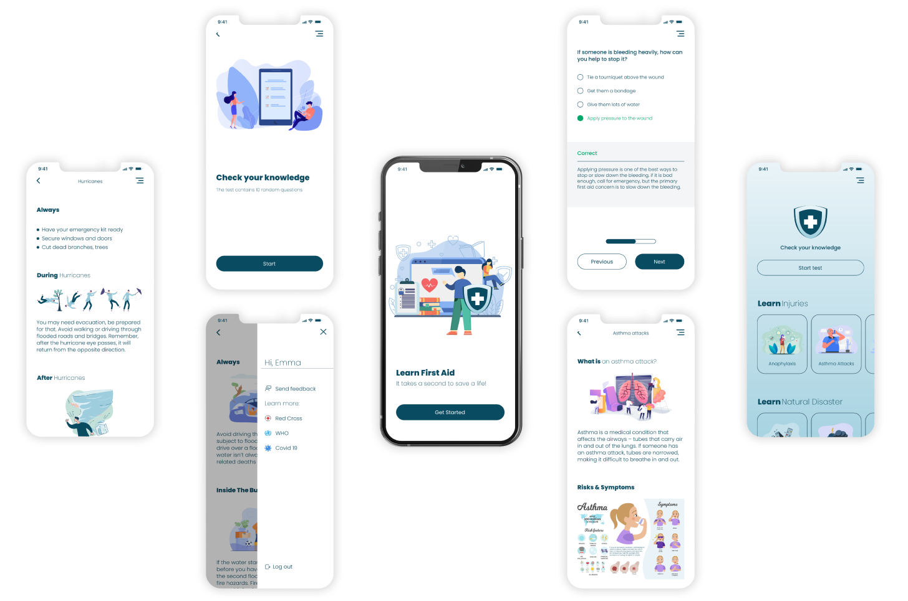

## LearnByPractice

Free Knowledge testing App for Self Educators to explore different topics for READ, LEARN & PRACTICE!

 
 

<a  target="_blank">Android</a>, 
<a  target="_blank">iOS</a> & 
<a  target="_blank">Web</a> <b>Currently working to share code</b> between them.
 

  <!-- 

    
    
  
 -->
 

## Why

- To improve General Education
- It should be FREE to learn & prepare for DMV driver licenses
- It should be easy to learn Basic Medical Assistance
- Everyone should know First Aid fundamentals

 
 

## Screenshots

### Mobile

 
 

## Tech Stack

- [TypeScript](https://github.com/Microsoft/TypeScript)
- [Create React App](https://github.com/facebook/create-react-app)

- [React](https://github.com/facebook/react) _(100% [Hooks](https://reactjs.org/docs/hooks-intro.html), zero classes)_
- [React Native](https://github.com/facebook/react-native)
- [React Native Web](https://github.com/necolas/react-native-web)

 
